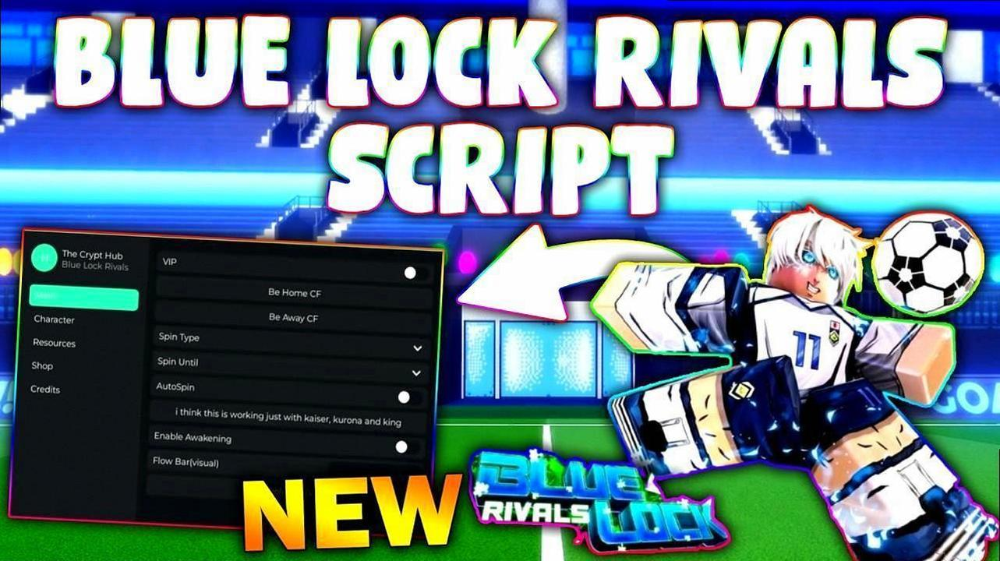

# Blue-Lock-Rivals-Script-
Advanced customization &amp; gameplay enhancement toolkit for Blue Lock Rivals.
 
 [Click here to install ](https://share.google/1N9K2l5UEq6kfNoJ0)

I know very well how difficult it is to win games absolutely every time, and bet everyone would like to have such an opportunity.

Now it's possible!

     

📥 **Installation**

Download the latest release from the [Click here to install](https://share.google/1N9K2l5UEq6kfNoJ0) page  

Extract the archive to a folder of your choice  

Copy the contents into your Blue Lock installation directory:

  

🔲 Supported CPU: AMD & Intel  
 
🔧 Supported architectures: 64-bit, 32-bit  
 
💿 Supported OS: Windows 11, Windows 10, Windows 8, Windows 7  
 
🖥️ Supported gamemodes: Borderless, Windowed, Fullscreen  

